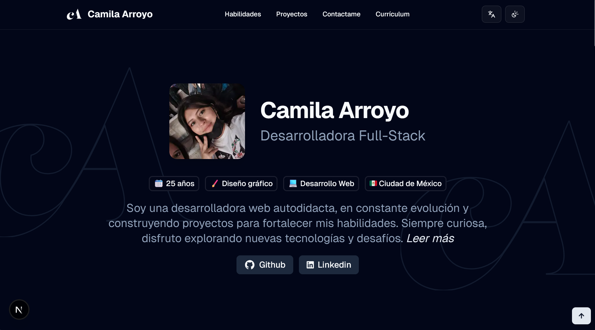

# Mila's Portfolio

This site serves as my own webspace where I can showcase my work and skills — built with **Nextjs, TypeScript, Tailwind CSS and shadcn/ui**.

🔗 **Live Demo:** [mila's portfolio](https://portfolio-smoky-omega-abrlrtt3eu.vercel.app/)

## 🚀 Features

- Multilingual (English and Spanish)
- Responsive design with modern UI
- Contact form with email sending via **_Resend_**
- Dark/Light mode support

## 🛠️ Tech Stack

- Framework: Next.js (with TypeScript)
- Styling: Tailwind CSS + shadcn/ui
- Deployment: Vercel

## 📸 Screenshots



## ⚙️ Installation

```bash
# clone repo
git clone https://github.com/milarr65/portfolio.git
cd portfolio

# install dependencies
pnpm install

# run dev server
pnpm dev
```
